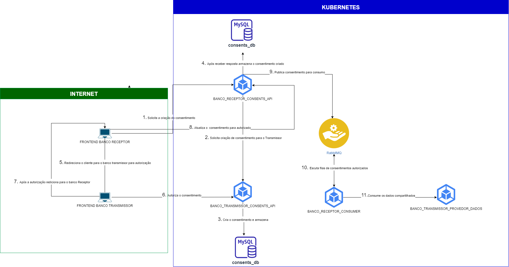

## Trabalho de MICROSERVICE DEVELOPMENT TRABALHO 2

Projeto evolucao do Trabalho 2 do Microservice.

### k8s

Yamls de configuracao estao na pasta /k8s.


### Topologia da solução



### Tecnologias utilizadas

- k8s
- NodeJs
- Typescript
- Nestjs - Framework para backend Nodejs
- Angular
- Nx - Monorepo
- MySQL
- RabbitMQ
- Docker

### Rodando com k8s

## Tutorial

Utilizamos o [KIND](https://kind.sigs.k8s.io/). Ferramenta que auxilia na execução de clusters Kubernetes locais usando “nós” de contêiner Docker.

- Com o KIND instalado, executar o comando abaixo para criar um cluster:

```
$ kind create cluster
```

- Utilizamos o MetalLB para obter o servico do tipo loadbalancer, para configuração executar:
-- Aguarde ate que os pods do MetalLB estejam prontos.

```
kubectl apply -f https://raw.githubusercontent.com/metallb/metallb/v0.13.7/config/manifests/metallb-native.yaml
```

- Para realizar a configuração do cluster, executar o comando:

```
$ kubectl apply -f .\k8s\
```


### Desenvolvedores

| RM  | Aluno | Turma |
| ------------- |:-------------:| --------- | 
| 344792      | Benisson dos Santos Lopes     | 1SCJRBB-2022 |
| 344799      | Leonardo Guerra Torres Filho     | 1SCJRBB-2022 |
| 344801      | Lucas Eugenio Ribeiro     | 1SCJRBB-2022 |
| 344794      | César de Lira Santos     | 1SCJRBB-2022 |
| 344791      | Anderson Evangelista     | 1SCJRBB-2022 |